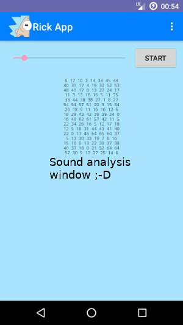

# Rick App

**play automatic burp in silent situations**

The Rick-App plays a automatic burp in silent situation. This App makes it possible to talk like Rick in *Rick and Morty*.

Support me: 

[APK File](https://raw.githubusercontent.com/no-go/RickApp/master/app/app-release.apk) or get the App from [f-Droid](http://f-droid.org)

## App Icon

## Features

- Threshold ruler: modify the noise limit
- RickApp plays a burp sound, if there is a realy short time without noise
- It plays a new burp only after 2 seconds to protect from endless burps
- If your mobile plays sound, RickApp *hears* it, too.
- RickApp shows the sound sampling values in a textbox

Your Screen is off, but RickApp does not sleep! Use the *recent App* feature of your Homescreen and close RickApp by swiping it away.

    This App uses the microphone! You can not use the microphone, if you get a call and RickApp works!

## Screenshot

## License

I publish everything under the free BSD-2 License.
